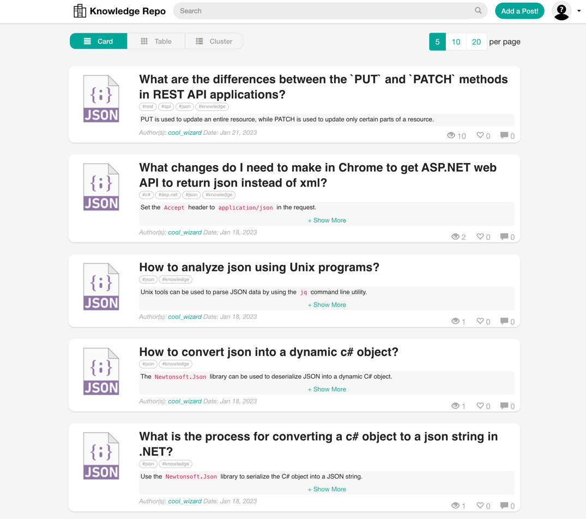
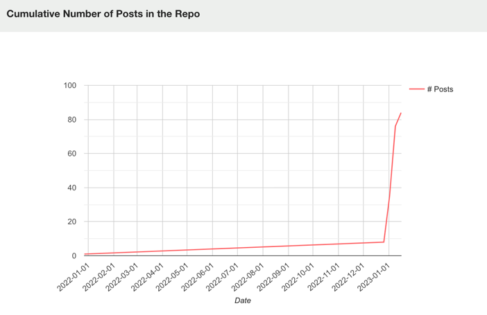
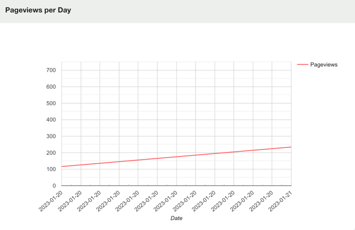

# Knowledge Repo

## About the Knowledge Repo
The Knowledge Repo project aims to streamline the sharing of knowledge among data scientists and other technical roles 
by utilizing data formats and tools that are commonly used in these professions. Our platform offers various options for 
storing and managing "knowledge posts", with a focus on utilizing notebooks (such as R Markdown and Jupyter/IPython 
Notebook) to better promote reproducible research.

## Content Submission Options
### 1. Github Integration: 
Easily submit your posts in markdown format directly through Github. Our platform will automatically 
detect and publish your new content in a timely manner.

### 2. Built-in Editor: 
Utilize our user-friendly editor to compose and upload your posts in various formats including Jupyter Notebook, R 
markdown, and Google document link. We securely store your content on our internal storage for easy access and management. 
Users can make updates, delete, share, and add comments to their posts after publishing.

## Getting Started
- #### [**Installation Instruction**](http://knowledge-repo.readthedocs.io)
- #### [**Hosted Live Version**](https://www.knowledge-repo.com)
- #### [**Source**](https://github.com/airbnb/knowledge-repo)
For more information about the motivation and inspiration behind this project, we encourage you to read our 
[Medium Post](https://medium.com/airbnb-engineering/scaling-knowledge-at-airbnb-875d73eff091).

## Contact
- [**Bug reports**](https://github.com/airbnb/knowledge-repo/issues)
- **Ask us questions**
  - [**Knowlegde-repo Slack**](https://join.slack.com/t/knowledgerepogroup/shared_invite/zt-1oxlql877-R_WUl5qGWVOt3EMs9iRKZQ)
  - **Email**: airbnb.knowledge.repo@gmail.com

## Screenshots

| Name                                              | Screenshot(s)                                                                                                                 |
|---------------------------------------------------|-------------------------------------------------------------------------------------------------------------------------------|
| [Feed](https://www.knowledge-repo.com/feed)       |                                                                                 |
| [Example Post](https://www.knowledge-repo.com/post/example%2Fexample_md.kp)       |  |
| [New Post](https://www.knowledge-repo.com/create)       |  |
| [Post Form](https://www.knowledge-repo.com/edit?proxy=true)       |  |
| [Stats](https://www.knowledge-repo.com/stats)       |                               |
  